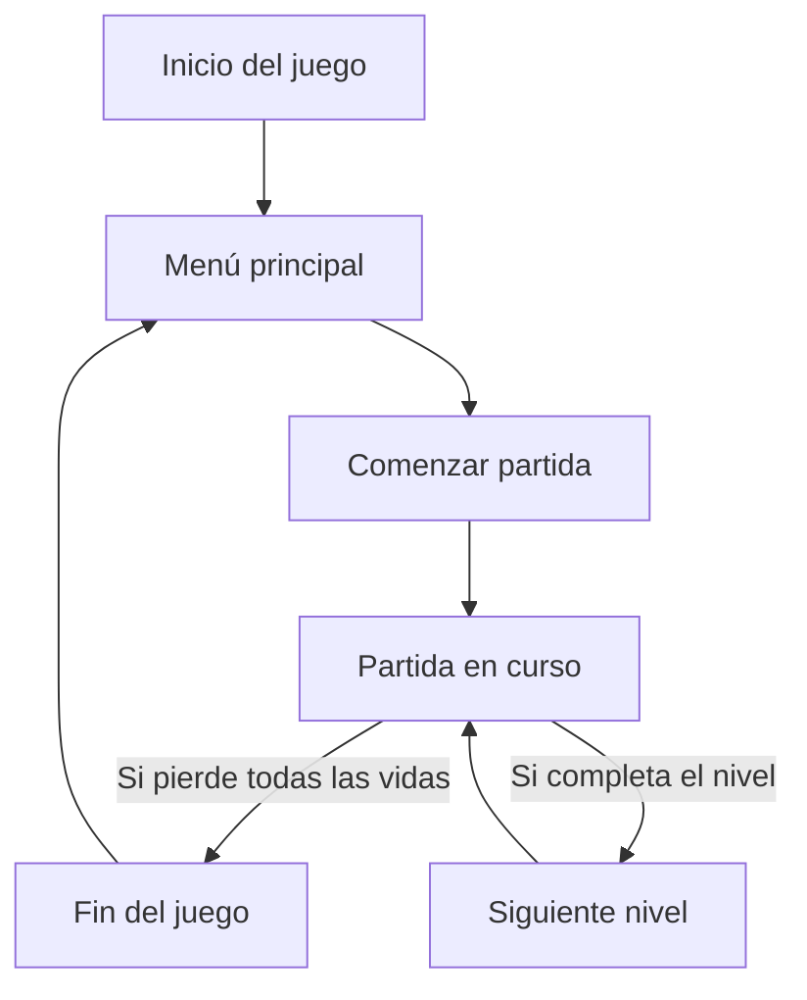

# space_videogame

## Introducción

`space_videogame` es un videojuego 2D inspirado en los clásicos del género espacial. El objetivo principal es ofrecer una experiencia de juego entretenida donde el jugador controla una nave espacial, esquiva obstáculos y destruye enemigos para avanzar de nivel. Este proyecto es ideal para quienes desean explorar conceptos de desarrollo de videojuegos y programación gráfica.

## Características

- Jugabilidad de estilo arcade clásico.
- Control total de la nave espacial con teclado.
- Generación y manejo de enemigos con dificultad progresiva.
- Sistema de puntuación y vidas.
- Sonidos y efectos visuales atractivos.
- Arquitectura modular para facilitar la extensión y el aprendizaje.

## Requisitos

Antes de instalar y ejecutar el juego, asegúrate de cumplir con los siguientes requisitos:

- Python 3.7 o superior.
- Biblioteca `pygame` instalada.
- Sistema operativo compatible con Python y pygame (Windows, macOS, Linux).
- Recomendado: tarjeta gráfica básica para un mejor rendimiento.

## Instalación

Sigue estos pasos para instalar y ejecutar el videojuego en tu entorno local:

1. Clona el repositorio:
   ```bash
   git clone https://github.com/aina-carbonell/space_videogame.git
   cd space_videogame
   ```

2. Instala las dependencias:
   ```bash
   pip install pygame
   ```

3. Ejecuta el juego:
   ```bash
   python main.py
   ```

## Licencia

Este proyecto se distribuye bajo la licencia MIT. Esto significa que eres libre de usar, modificar y distribuir el código, siempre y cuando incluyas una copia de la licencia original.

## Contribución

¡Las contribuciones son bienvenidas! Para colaborar en el desarrollo de `space_videogame`, sigue estos pasos:

- Haz un fork del repositorio.
- Crea una nueva rama con tu mejora o corrección:  
  ```bash
  git checkout -b mi-mejora
  ```
- Realiza tus cambios y haz commits descriptivos.
- Sube tus cambios a tu fork:
  ```bash
  git push origin mi-mejora
  ```
- Abre un Pull Request explicando tus cambios.

Por favor, sigue las buenas prácticas de desarrollo y asegúrate de que los tests (si existen) pasen correctamente antes de enviar tu contribución.

## Configuración

El juego puede personalizarse mediante la edición de archivos de configuración o parámetros en el código. Algunas opciones que puedes modificar:

- Velocidad de la nave y enemigos.
- Número de vidas iniciales.
- Resolución de la pantalla y modo ventana/pantalla completa.
- Recursos gráficos y de sonido (ubicados en las carpetas correspondientes).

Ejemplo de cambio de configuración en el archivo de constantes:
```python
NAVE_VELOCIDAD = 5
ENEMIGO_VELOCIDAD = 3
VIDAS_INICIALES = 3
TAMANO_PANTALLA = (800, 600)
```

## Uso

Cuando ejecutes el juego, utiliza las siguientes teclas para interactuar:

- **Flechas**: Mover la nave espacial.
- **Espacio**: Disparar.
- **Esc**: Pausar o salir del juego.

El objetivo es eliminar el mayor número de enemigos posible sin perder todas las vidas. A medida que avances, la dificultad aumentará y aparecerán más desafíos.

### Flujo básico del juego



¡Diviértete, aprende y no dudes en contribuir para mejorar este divertido videojuego espacial!

## Disclaimer de IA

Se ha usado la página https://app.docuwriter.ai para generar este fichero Readme.
Únicamente se ha hecho uso de la IA para la realización del Readme.md, con la finalidad de explorar que tan bien lo hace.
El resto del proyecto ha sido realizado única y exclusivamente por mi (Aina Carbonell) siguiendo las indicaciones de la asignatura Diseny i Programació Orientada a Objectes de la UOC.